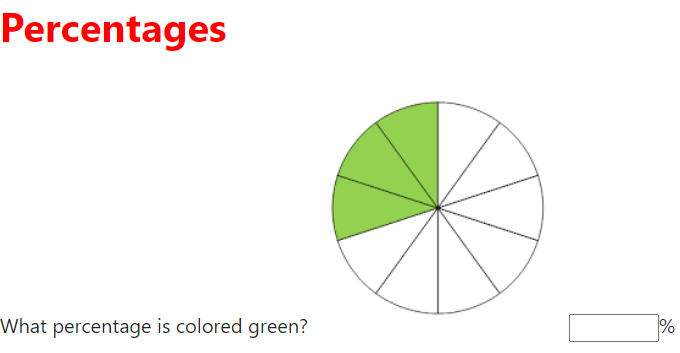
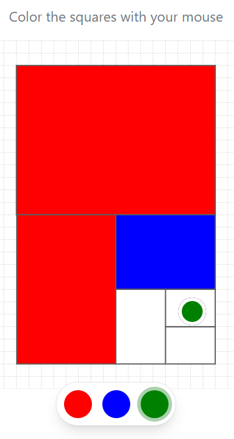
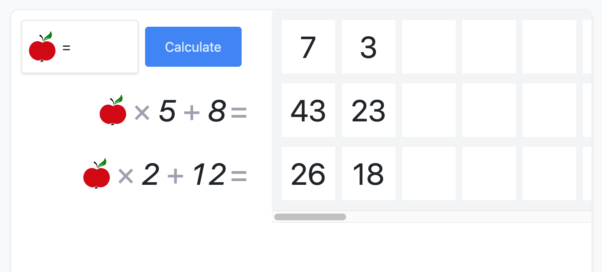
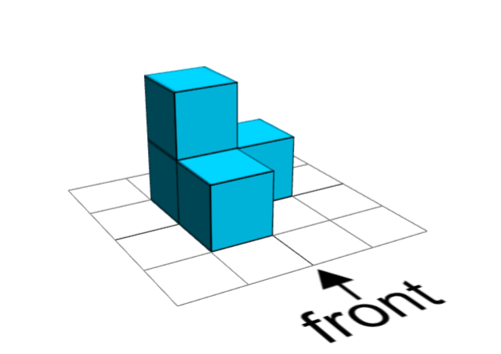

# @citolab tspci-examples

Example PCI's created with @citolab/tspci

[github](https://github.com/Citolab/tspci/lib/tspci) | 
[npm](https://www.npmjs.com/package/@citolab/tspci)

There are 4 examples in this repository that can give a head start while creating new Portable Custom Interactions.
To run these examples go the to folder of the specific example and run:

``` sh
npm i
npm run dev
```

## Testing PCIs

These PCIs can be tested in [qti.citolab.nl](https://qti.citolab.nl).

### Using QTI3 export (direct import)

The `package-qti3` script creates a zip file that can be directly imported into [qti.citolab.nl](https://qti.citolab.nl).

``` sh
npm run package-qti3
```

### Using TAO export

You can also import PCIs into TAO first:

1. Use the TAO export to import the PCI
2. In TAO, go to **Settings → Portable Custom Interactions → Add** to register the PCI
3. Create an item using the PCI
4. Export the item as QTI 2.2

When you import the QTI 2.2 package into [qti.citolab.nl](https://qti.citolab.nl), it will automatically upgrade the package and ensure the PCI works.

## tspci-hello-world

There should alwas be a 'hello world' example. So here it is: the most basic example of an PCI.

- Displaying 'Hello world'

## tspci-vanilla-js

Very basic implementation of a PCI where the test-taker can interact.

- Texts and size can be configured
- Image is bundled in output file

<p align="center">
  
</p>

## tspci-color-proportions

PCI where the test-taker can color parts of a rectangle.

- Colors, size, scalable can be configured
- Uses tailwind for styling
- Item-author can provide the correct answer in TAO
- Scores automatically based on proportions

<p align="center">
  
</p>

## tspci-hauntedjs

Example PCI using [haunted](https://github.com/matthewp/haunted) instead of preact.

Simple PCI for finding the correct variable

<p align="center">
  
</p>

## tspci-3d-blocks

PCI where the test-taker has to build a blocks.

- gridDivisions and pixel size of boxes can be configured
- Uses three.js orbitcontrols to render the 3d boxes and is bundled in the PCI output file. 
- Uses tailwind for styling
- Item-author can provide the correct answer in TAO
- Scores automatically based on front, side and to view.

<p align="center">
  
</p>