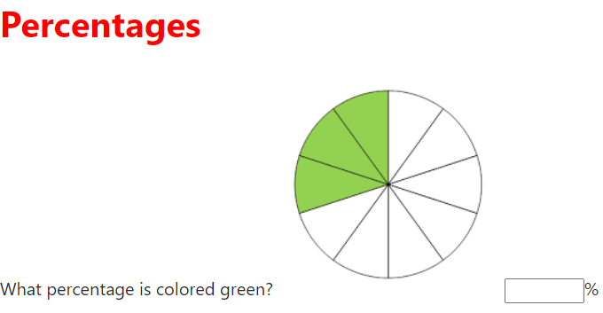
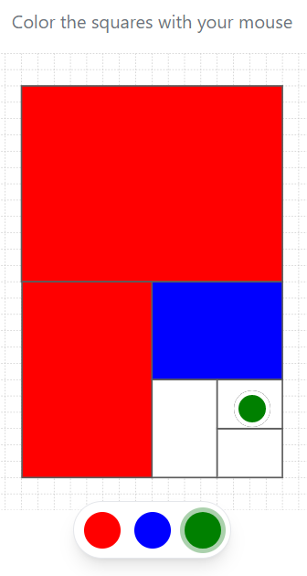
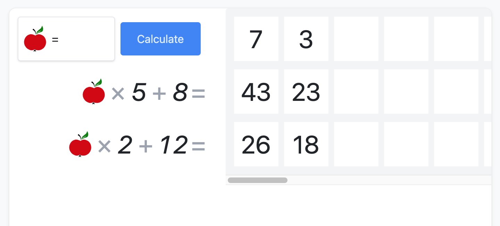
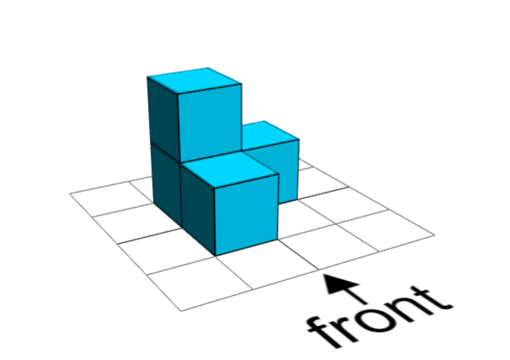

# @citolab tspci-examples

Example PCI's created with @citolab/tspci

[github](https://github.com/Citolab/tspci/lib/tspci) | 
[npm](https://www.npmjs.com/package/@citolab/tspci)

There are 4 examples in this repository that can give a head start while creating new Portable Custom Interactions.
To run these examples go the to folder of the specific example and run:

``` sh
npm i
npm run dev
```

## Testing PCIs

These PCIs can be tested in [qti.citolab.nl](https://qti.citolab.nl).

### Using QTI3 export (direct import)

The `package-qti3` script creates a zip file that can be directly imported into [qti.citolab.nl](https://qti.citolab.nl).

``` sh
npm run package-qti3
```

### Using TAO export

You can also import PCIs into TAO first:

1. Use the TAO export to import the PCI
2. In TAO, go to **Settings → Portable Custom Interactions → Add** to register the PCI
3. Create an item using the PCI
4. Export the item as QTI 2.2

When you import the QTI 2.2 package into [qti.citolab.nl](https://qti.citolab.nl), it will automatically upgrade the package and ensure the PCI works.

## SBOM

Every production build writes a [CycloneDX](https://cyclonedx.org/) SBOM of the bundle to
`dist/sbom.cdx.json`, and the export scripts copy it next to the package, for example
`qti3-dist/qti3-pci-blocks_1.0.0.sbom.cdx.json`. No flag is needed, use `--no-sbom` to skip it.

The SBOM is built from the bundler module graph, so it lists the packages whose code is actually in the
delivered file. For `tspci-3d-blocks` that is three components:

``` json
"components": [
  { "purl": "pkg:npm/%40citolab/preact-store@2.9.12", "licenses": [{ "license": { "id": "MIT" } }] },
  { "purl": "pkg:npm/preact@10.28.2",                 "licenses": [{ "license": { "id": "MIT" } }] },
  { "purl": "pkg:npm/three@0.136.0",                  "licenses": [{ "license": { "id": "MIT" } }] }
]
```

Two things this example shows nicely. The build time dependencies (`@types/three`, `archiver`,
`autoprefixer`, `tailwindcss`) are not in the SBOM, because they are not delivered. And
`three-orbitcontrols` is not in it either: `interaction.tsx` imports `OrbitControls` from
`three/examples/jsm/controls/OrbitControls`, so that code belongs to `three` itself and the separate
`three-orbitcontrols` dependency is never bundled. A dependency tree based SBOM would list both as
shipped components.

Transitive dependencies are included when their code is bundled. `tspci-color-proportions` lists six
components: next to `preact` and `preact-store` also `@react-hook/mouse-position` and the three
`@react-hook` packages it pulls in. The PCI itself is the top level entry of the `dependencies` graph in
the document, so a consumer can also read just the direct dependencies from it.

The SBOM also records a SHA-512 hash of the built bundle, so whoever integrates the PCI can verify that
the SBOM belongs to the file they received.

`tspci-3d-blocks` shows the optional `config.tspci.sbom` settings in its `package.json`, in this case a
supplier and an external reference. A real product would point those references at its vulnerability
disclosure policy and security contact. The other examples use the defaults, which need no
configuration at all. See the
[@citolab/tspci readme](https://github.com/Citolab/tspci/tree/main/lib/tspci#sbom) for all options.

## tspci-hello-world

There should alwas be a 'hello world' example. So here it is: the most basic example of an PCI.

- Displaying 'Hello world'

## tspci-vanilla-js

Very basic implementation of a PCI where the test-taker can interact.

- Texts and size can be configured
- Image is bundled in output file

<p align="center">
  
</p>

## tspci-color-proportions

PCI where the test-taker can color parts of a rectangle.

- Colors, size, scalable can be configured
- Uses tailwind for styling
- Item-author can provide the correct answer in TAO
- Scores automatically based on proportions

<p align="center">
  
</p>

## tspci-hauntedjs

Example PCI using [haunted](https://github.com/matthewp/haunted) instead of preact.

Simple PCI for finding the correct variable

<p align="center">
  
</p>

## tspci-3d-blocks

PCI where the test-taker has to build a blocks.

- gridDivisions and pixel size of boxes can be configured
- Uses three.js orbitcontrols to render the 3d boxes and is bundled in the PCI output file. 
- Uses tailwind for styling
- Item-author can provide the correct answer in TAO
- Scores automatically based on front, side and to view.

<p align="center">
  
</p>